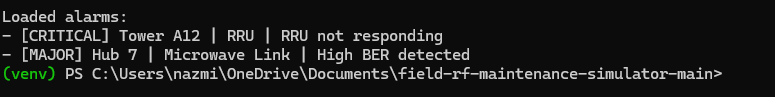

# Field RF / Telecom Maintenance Simulator (Python)

A Python-based command-line simulator designed to model real-world telecom and RF maintenance workflows. The tool loads network and site alarms from structured JSON data and presents them in a technician-friendly format to support alarm monitoring, triage, and escalation activities commonly performed by Field Technicians and Network Operations Center (NOC) staff.

## Key Capabilities
- Alarm monitoring and visualization by severity (CRITICAL, MAJOR, MINOR)
- Structured alarm data handling (site, equipment, description)
- Input validation and error handling for missing or invalid data sources
- Extendable design for alarm acknowledgment, dispatch, and escalation workflows

## Real-World Relevance
This project mirrors common responsibilities in telecom operations environments, including:
- Reviewing and prioritizing alarms based on severity
- Identifying impacted sites and network equipment
- Supporting escalation paths and maintenance response decisions
- Working with structured operational data (JSON)

## Technology Stack
- Python 3
- JSON
- pathlib (cross-platform file handling)
- Command-line interface (CLI)

 ## Example Output

 This simulator demonstrates alarm triage, technician dispatch, escalation handling,
and structured shift logging similar to real NOC and field maintenance workflows.


Sample shift log (JSONL): `shift_log.jsonl`


## Project Structure
```text
field-rf-maintenance-simulator-main/
├── data/
│   └── src/
│       ├── app.py
│       └── sample_alarms.json
└── README.md


